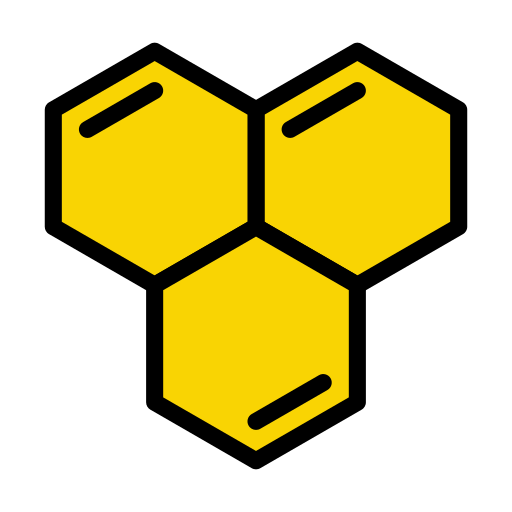
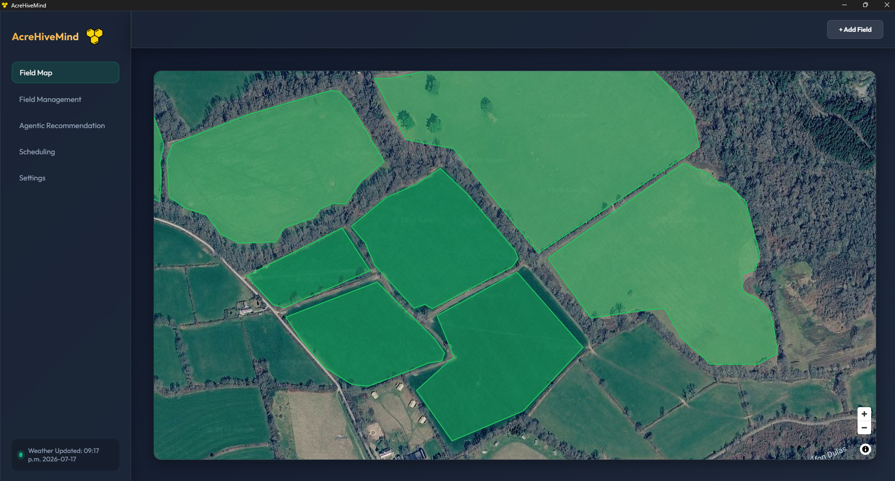
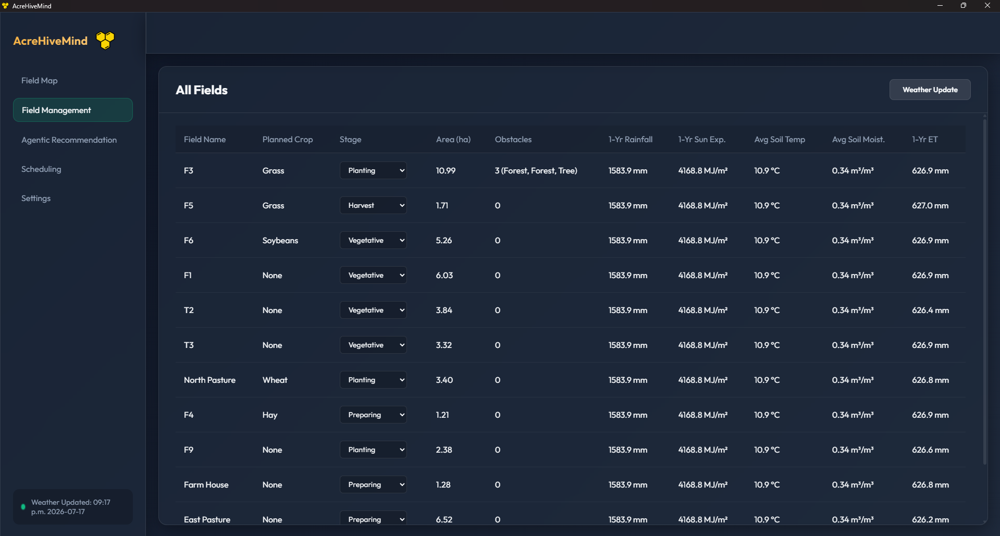
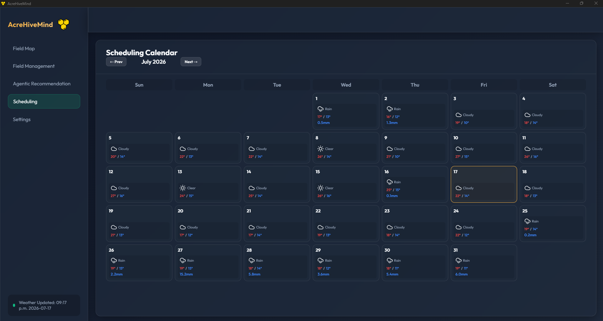
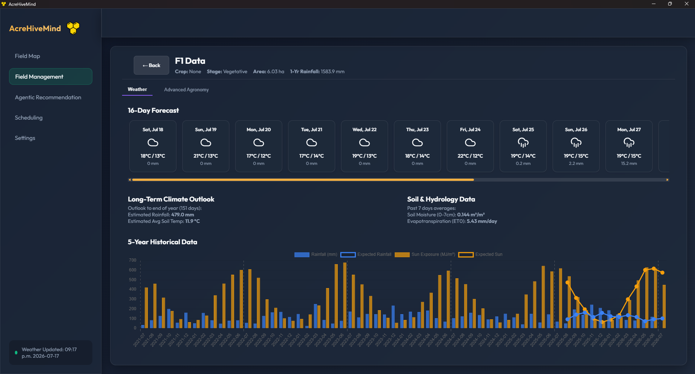
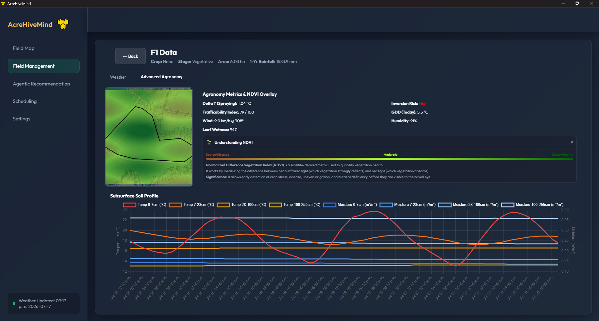
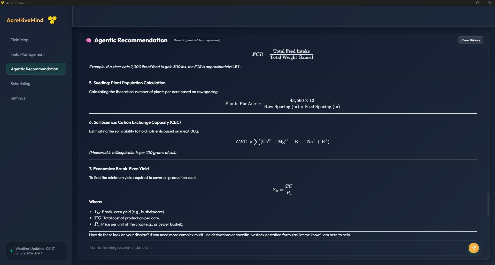

<div align="center">
  
  <h1>AcreHiveMind</h1>
  <p><strong>A Next-Generation Farm Management & AI Agronomy Assistant</strong></p>
</div>

> [!WARNING]
> **OS Support:** AcreHiveMind currently only supports **Windows**. Support for macOS and Linux may be added in future releases.

AcreHiveMind is a powerful desktop application built using **Tauri**, **Vanilla TypeScript**, and **Rust**. It provides an interactive map for defining farm fields and obstacles, tracking crop stages, viewing detailed weather/climate data, managing farm profiles, and integrating local machine learning workflows (like MobileSAM) for automated field segmentation.

---

## 📸 Screenshots

| Field Management | Data Tables |
| :---: | :---: |
|  |  |

| Scheduling & Weather | Field Weather Insights |
| :---: | :---: |
|  |  |

| Advanced Agronomy | Agentic AI Chat |
| :---: | :---: |
|  |  |

---

## 🚀 Building the Application

### ⚡ Quick Windows Setup (Recommended for New Machines)
If you are on a fresh Windows machine, you can run the provided automated setup script. This script installs Node.js, Git, Rust, Visual Studio C++ Build Tools, and Miniconda using `winget`.

1. Open PowerShell as Administrator.
2. Run the script:
   ```powershell
   .\setup_dev_env.ps1
   ```
3. Restart your terminal, then initialize the GDAL Conda environment:
   ```powershell
   conda create -n gdal-env -c conda-forge gdal=3.7.0 -y
   ```

### Manual Setup & Prerequisites
- [Node.js](https://nodejs.org/) (v20+ recommended)
- [Rust](https://rustup.rs/) (stable)
- **GDAL**: The Rust backend depends on the GDAL library. On Windows, you can install it using `vcpkg` or by setting up a Conda environment (`conda install -c conda-forge gdal=3.7.0`) and configuring `GDAL_LIB_DIR` / `GDAL_INCLUDE_DIR`.

### Setup
1. Clone the repository and install frontend dependencies:
   ```bash
   npm install
   ```
2. Run the development server (starts Vite and the Tauri desktop window):
   ```bash
   npm run tauri dev
   ```
3. To build the final release executable:
   ```bash
   npm run build
   npm run tauri build
   ```

---

## 🧪 Running Unit Tests

The project includes tests for both the frontend (Vitest) and the backend (Cargo).

**Frontend Tests:**
```bash
npm run test
```
*To run frontend tests in watch mode, use `npm run test:watch`.*

**Backend Tests (Rust):**
```bash
cd src-tauri
cargo test
```

---

## 🤝 Pull Requests & Release Cycle

We enforce semantic versioning for all contributions.

### Current Software Tag: `v0.1.0`

### Pull Request Rules
- Every Pull Request **must** include a version bump in the `VERSION` file (located in the root directory).
- Update the version according to semantic versioning (Major, Minor, or Patch).
- The CI pipeline (`ci.yml`) will check the `VERSION` file against the current latest software tag. If they match (meaning you forgot to bump it), the PR will be blocked.
- When your PR is merged into `main`, the `release.yml` workflow automatically reads your bumped `VERSION` file, builds the `.exe` for Windows, and publishes a new GitHub Release with the new tag.

For more detailed information on architecture and specific components, please check the [Documentation](DOCUMENTATION.md).
