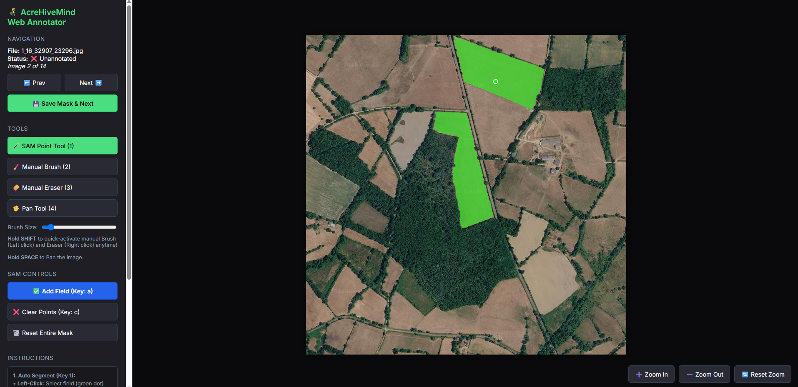

# AcreHiveMind Web Annotator

A powerful, web-based dataset annotation tool designed for rapid, AI-assisted labeling of agricultural satellite imagery. It leverages the Segment Anything Model (SAM) from Ultralytics to automatically segment field boundaries with high precision.



## 🚀 Setup & Launch

1. **Install Requirements:**
Ensure you have the required dependencies installed (including Flask for the web backend):
```bash
pip install ultralytics opencv-python Flask Flask-Cors numpy pillow
```

2. **Start the Server:**
Launch the Python backend from the `ml` directory:
```bash
python web_annotator.py
```

3. **Open the Annotator:**
Open your favorite web browser and navigate to:
```
http://localhost:5000
```

## 🛠️ Tools & Controls

### 🪄 1. SAM Point Tool (Hotkey: `1`)
Leverage the Segment Anything Model (SAM) to auto-generate perfect field masks.
- **Left-Click:** Add a positive (green) point to tell SAM "this is part of the field".
- **Right-Click:** Add a negative (red) point to tell SAM "exclude this area".
- **`a` Key:** **Lock it in!** Once the green shape looks perfect, press `a` (or click "Add Field") to lock that field into the permanent mask and move on to the next field in the same image.
- **`c` Key:** Clear your current SAM points if the model gets confused and you want to try different points.

### 🖌️ 2. Manual Brush Tool (Hotkey: `2`)
Need to make a tiny correction that SAM missed? Use the manual brush to paint the mask directly.
- **Click & Drag:** Paint green mask directly onto the image.
- *Adjust the brush size slider in the sidebar to match the area.*

### 🧽 3. Manual Eraser (Hotkey: `3`)
Quickly erase mistakes.
- **Click & Drag:** Erase any part of the active mask (even previously locked fields).

### 🖐️ 4. Pan Tool (Hotkey: `4`)
- **Click & Drag:** Pan around the high-resolution satellite image.
- **Scroll Wheel:** Zoom In and Zoom Out for pixel-perfect editing.
- *Shortcut:* You can hold the **`SPACEBAR`** at any time (even while using other tools) to temporarily switch to panning mode!

### ⚡ Quick Edit Modifier (Hold `SHIFT`)
While you are using the **SAM Point Tool**, you can hold down the **`SHIFT`** key to temporarily activate Quick Edit mode!
- While holding `SHIFT`, **Left-click** acts as the Manual Brush.
- While holding `SHIFT`, **Right-click** acts as the Manual Eraser.
- Let go of `SHIFT` to instantly return to clicking SAM points!

## 💾 Saving Your Work
Once you have fully annotated all the fields in the current image:
1. Press the **`ENTER`** key (or click the **Save Mask & Next** button in the sidebar).
2. The tool will automatically save the generated mask as a 1-channel binary PNG in the `dataset/<split>/masks/` folder, formatted perfectly for model training.
3. The next unannotated image in your dataset will instantly load for you to continue!
